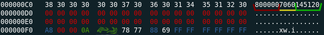

## Research on Bravida Integra access system
* Added generated dictionary with possible KeyA's on their Mifare 1k 4b cards.
* Added Integra_access_v5.pdf and Integra_access_v6.pdf with technical info.

## Screenshot of sector 3
  
Top right corner: **GREEN:** card number. **YELLOW:** system id? **RED:** system?

## Some notes to self:
* You need a clean reading of sector 0 and sector 3 with the keys in the dictionary (based on my initial research).
* Most sectors use the key 0xFFFFFFFFFFFF for read and write, only the important data is programmed with another KeyA and KeyB.
* You do not need KeyB on sector 3 to emulate, this is only used for initial read and programming at the guard station in my experience.
* Access bits on sector 3 is set to 78778869
